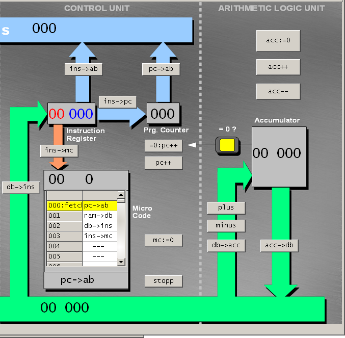

# Indice lezioni
## Ordino le lezioni con materiale utile per le verifiche

### Mi raccomando non sono utili solo questi appunti ma anche gli approfondimenti che vi ho assegnato.

Modello di Von Neumann

<table>
  <tr>
    <td>
      

        Nell'architettura di Von Neumann abbiamo 2 componenti fondamentali: 
        <ul>
            <li> <b>Elaborazione</b> -> CPU: "central processing unit" ovvero "unità centrale di elaborazione</li>
            <li> <b>Memorizzazione</b> -> MEMORIA CENTRALE: a livello teorico la possiamo indicare così ma nella realtà ci riferiamo alla RAM ("random access memory" ovvero "memoria ad accesso casuale")</li>
            <li> <b>Trasmissione</b> -> Bus: canale di comunicazione che permette a periferiche e componenti di un sistema elettronico di interfacciarsi tra loro scambiandosi informazioni. Il percorso principale è uno ma suddiviso in tre categorie di bus: indirizzi, dati e di controllo.</li>
            <li> <b>Comunicazione</b> -> Unità di I/O: permettono l'immissione di informazioni per l'elaborazione e la restituzione dei medesimi o altri elaborati all'operatore</li>
      	</ul>
        <ul>
            <li>prova</li>
        </ul>
      

    </td>
    <td>
      
    </td>
  </tr>
</table>

Elaborazione

<table>
  <tr>
    <td>
      

        <b>CPU</b>
        <ul>
	<li><b>ALU</b>: Arithmetic and Logic Unit ovvero unità aritmetico logica, il cui scopo è effettuare i calcoli matematici e logici (matematica boleana)</li>
	<li><b>CU</b>: Control Unit ovvero unità di controllo, il cui scopo è coordinare tutte le azioni necessarie per l'esecuzione di una istruzione o di un insieme di istruzioni (come abbiamo detto in classe coordina gli altri componenti nella corretta esecuzione delle istruzioni)</li>
	<li><b>FPU</b>: Floating Point Unit ovvero unità di calcolo in virgola mobile, il cui compito sono i calcoli matematici in virgola mobile</li>
	<li><b>RU</b>: Register Unit ovvero unità di registro, il cui compito è memorizzare lo stato in cui si trova la CPU</li>
	</ul>
      

    </td>
    <td>
      
    </td>
  </tr>
</table>

Memorizzazione

<table>
  <tr>
    <td>
      

	<UL>
	<b>RAM</b>
		<li>Memoria ad <b>accesso casuale</b>, definità così perchè il tempo di accesso a ciascuna locazione di memoria, non dipende dalla locazione stessa (in breve il tempo di accesso alle informazioni è sempre il medesimo sia che si trovi nelle prime locazioni che nelle ultime). 
		Da definizione sappiamo anche essere definita come memoria <b>volatile</b> e questo dipende dal fatto che la capacità di memorizzare informazioni sia fattibile solo se alimentata  
		<li>Gli indirizzi sono espressi in <b>esadecimale</b> (sul jhonny giocosamente in decimale)</li>
		<li>Può contenere due tipi di informazioni: <b>istruzioni</b> o <b>valori</b></li>	
	</ul>
      

    </td>
    <td>
      
    </td>
  </tr>
</table>
	

Comunicazione

<table>
  <tr>
    <td>
      

        <ul>
        <b>Unità di input</b>  
        Tramite la quale i dati vengono inseriti nel calcolatore per essere elaborati
        </ul>
	<ul>
	<b>Unità di output</b>  
	Necessaria affinché i dati elaborati possano essere restituiti all'operatore
	</ul>
      

    </td>
    <td>
      
    </td>
  </tr>
</table>

Trasmissione

<table>
  <tr>
    <td>
      

        <ul>
        <b>BUSww</b>  
        Tramite la quale i dati vengono inseriti nel calcolatore per essere elaborati
        </ul>
        <ul>
        <b>Unità di output</b>  
        Necessaria affinché i dati elaborati possano essere restituiti all'operatore
        </ul>
      

    </td>
    <td>
      
    </td>
  </tr>
</table>

11

22

33

44

55

66

## Link utili
 - [Fonti alu](https://www.instructables.com/8-bit-ALU-Arithmetic-Logic-Unit)
 - [Altre fonti](https://prova.it)
-----