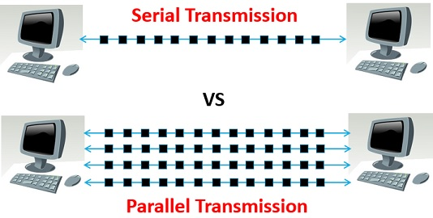
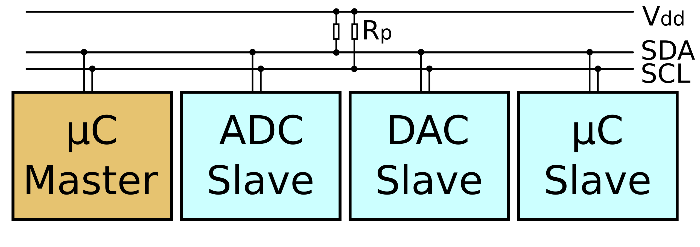
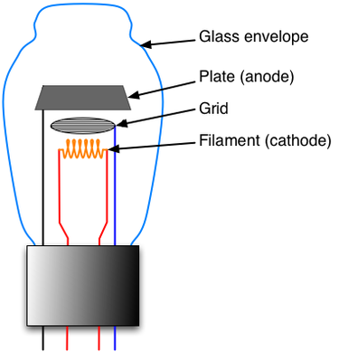

# Indice lezioni
## Ordino le lezioni con materiale utile per le verifiche

### Mi raccomando non sono utili solo questi appunti ma anche gli approfondimenti che vi ho assegnato.
### Inoltre aggiungo che qui ho fatto un resoconto di tutto ma voi, con tutti i discorsi fatti in classe anche basati sulle mie esperienze potreste avere sul vostro quaderno più info di quante ne troviate qui

Modello di Von Neumann

<table>
  <tr>
    <td>
      

        Nell'architettura di Von Neumann abbiamo possiamo distinguere i componenti in base ai ruoli: 
        <ul>
            <li> <b>Elaborazione</b> -> CPU: "central processing unit" ovvero "unità centrale di elaborazione"</li>
            <li> <b>Memorizzazione</b> -> MEMORIA CENTRALE: a livello teorico la possiamo indicare così ma dal punto di vista pratico è utile pensare alla RAM ("random access memory" ovvero "memoria ad accesso casuale")</li>
            <li> <b>Trasmissione</b> -> Bus: canale di comunicazione che permette a periferiche e componenti di un sistema elettronico di interfacciarsi tra loro scambiandosi informazioni. Il percorso principale è uno ma suddiviso in tre categorie di bus: indirizzi, dati e di controllo.</li>
            <li> <b>Comunicazione</b> -> Unità di I/O: permettono l'immissione di informazioni per l'elaborazione e la restituzione dei medesimi o altri elaborati all'operatore</li>
      	</ul>
      

    </td>
    <td>
      
    </td>
  </tr>
  
</table>

Elaborazione

<table>
  <tr>
    <td>
      

        <b>CPU</b>
        <ul>
	<li><b>ALU</b>: Arithmetic and Logic Unit ovvero unità aritmetico logica, il cui scopo è effettuare i calcoli matematici e logici (matematica boleana)</li>
	<li><b>CU</b>: Control Unit ovvero unità di controllo, il cui scopo è coordinare tutte le azioni necessarie per l'esecuzione di una istruzione o di un insieme di istruzioni (come abbiamo detto in classe coordina gli altri componenti nella corretta esecuzione delle istruzioni)</li>
	<li><b>FPU</b>: Floating Point Unit ovvero unità di calcolo in virgola mobile, il cui compito sono i calcoli matematici in virgola mobile</li>
	<li><b>RU</b>: Register Unit ovvero unità di registro, il cui compito è memorizzare lo stato in cui si trova la CPU</li>
	</ul>
      

    </td>
    <td>
      
    </td>
  </tr>
  <tr>
    <td>
        <ul>
            <li> <b>Elaborazione:</b> per simulare un circuito che effettui la somma, in aula abbiamo proceduto a ritroso partendo dalla somma tra due numeri espressi in binario, per poi realizzare un circuito combinatorio.</li>
        </ul>
    </td>
    <td>
        <ul>
            1101+101=10010
            <table>
              <tr>
                <td>1</td>
                <td>1</td>
                <td>0</td>
              </tr>
              <tr>
                <td>0</td>
                <td>0</td>
                <td>1</td>
              </tr>
              <tr>
                <td>1</td>
                <td>1</td>
                <td>0</td>
              </tr>
              <tr>
                <td>1</td>
                <td>0</td>
                <td>0</td>
              </tr>
              <tr>
                <td>0</td>
                <td>0</td>
                <td>1</td>
              </tr>
            </table>
        </ul>
    </td>
  </tr>
  <tr>
    <td>
      <ul>
        <li> Con questo metodo ci rendiamo conto che dovendo gestire due fasi (somma e riporto), necessitiamo di due porte logiche. Nella prima colonna 1101, nella seconda 101 e nella terza il risultato dell'operazione</li>
      </ul>
    </td>
    <td>
      Somma senza riporto (XOR)
      <table>
        <tr>
         <td>1</td>
         <td>1</td>
         <td>0</td>
        </tr>
        <tr>
          <td>0</td>
          <td>0</td>
          <td>0</td>
        </tr>
        <tr>
          <td>1</td>
          <td>1</td>
          <td>0</td>
        </tr>
        <tr>
          <td>1</td>
          <td>0</td>
          <td>1</td>
        </tr>
        <tr>
          <td>0</td>
          <td>0</td>
          <td>0</td>
        </tr>
      </table>
            Solo riporto (AND)
      <table>
        <tr>
         <td>1</td>
         <td>1</td>
         <td>1</td>
        </tr>
        <tr>
          <td>0</td>
          <td>0</td>
          <td>0</td>
        </tr>
        <tr>
          <td>1</td>
          <td>1</td>
          <td>1</td>
        </tr>
        <tr>
          <td>1</td>
          <td>0</td>
          <td>0</td>
        </tr>
        <tr>
          <td>0</td>
          <td>0</td>
          <td>0</td>
        </tr>
      </table>
    </td>
  </tr>
  <tr>
    <td>
      <ul>
        <li> Alla fine ci siamo resi conto che essendo le tabelle di verità delle porte logiche AND e XOR, probabilmente il circuito finale sarebbe stato simile all'immagine a lato</li>
      </ul>
    </td>
    <td>
      
    </td>
  </tr>
</table>

Memorizzazione

<table>
  <tr>
    <td>
      

	<UL>
	<b>RAM</b>
		<li>Memoria ad <b>accesso casuale</b>, definità così perchè il tempo di accesso a ciascuna locazione di memoria, non dipende dalla locazione stessa (in breve il tempo di accesso alle informazioni è sempre il medesimo sia che si trovi nelle prime locazioni che nelle ultime). 
		Da definizione sappiamo anche essere definita come memoria <b>volatile</b> e questo dipende dal fatto che la capacità di memorizzare informazioni sia fattibile solo se alimentata (inoltre non è costante in quanto non ha un contenuto costante)</li>
		<li>Gli indirizzi sono espressi in <b>esadecimale</b> (sul jhonny giocosamente in decimale)</li>
		<li>Può contenere due tipi di informazioni: <b>istruzioni</b> o <b>valori</b></li>	
	</ul>
      

    </td>
    <td>
      
    </td>
  </tr>
  <tr>
    <td>
      <ul>
        <li> Nel caso della <b>memorizzazione</b> abbiamo parlato del latch sr. Di cosa si tratta, niente popò di meno che dell'unità elementare di memoria (se l'immagine è troppo piccola cliccandoci sopra vi apre la directory ove presente il file originale)</li>
        <li>
          Nell'immagine notiamo le 2 "uscite", tra virgolette perchè in realtà è solo una l'uscita importante (<b>Q</b>), ed è quella da cui vengono letti i valori. L'altra uscita (<b>Q negato</b>), indica lo stato memorizzato utile anche per le fasi successive.
          In realtà serve sia il valore positivo che quello negato per pilotare circuiti digitali senza aggiungere un inverter esterno... ma questo se non lo avete capito no problem -> non ve lo chiedo in verifica tranquilli.
        </li>
      </ul>
    </td>
    <td>
      
    </td>
  </tr>
</table>
	

Comunicazione

<table>
  <tr>
    <td>
      

        <ul>
        <b>Unità di input</b>  
        Tramite la quale i dati vengono inseriti nel calcolatore per essere elaborati
        </ul>
        <ul>
        <b>Unità di output</b>  
        Necessaria affinché i dati elaborati possano essere restituiti all'operatore
        </ul>
      

    </td>
  </tr>
</table>

Trasmissione

<table>
  <tr>
    <td>
      <ul>
         <b>BUS</b>  
         <li>è un canale di comunicazione che permette a periferiche e componenti di un sistema elettronico - come ad esempio un computer - di interfacciarsi tra loro scambiandosi informazioni o dati di vario tipo attraverso la trasmissione e la ricezione di segnali.</li>
         Abbiamo visto tre tipi di bus:
         <li> <b>Data bus</b> </li> Bus ove transitano sia dati che istruzioni, utilizzato da tutti i dispositivi del sistema.
         <li> <b>Address bus</b> </li> Bus dove transitano indirizzi ove la cpu scrive o legge informazioni.
         <li> <b>Control bus</b> </li> Bus adibito al controllo e coordinamento delle attività del sistema, tramite esso la cpu può decidere quale componente deve scrivere sul data bus in un determinato momento, quale indirizzo leggere ...
      </ul>
    </td>
    <td>
      
    </td>
  </tr>
  <tr>
    <td>
      <ul>
        Abbiamo visto due tipi di comunicazione:
        <li>Seriale</li>
        <li>Parallelo</li>
      </ul>
    </td>
  </tr>
</table>

Seriale

<table>
  <tr>
    <td>Nella seriale, abbiamo due tipi di comunicazione: sincrona e asincrona</td>
    <td>
       <ul>
        <li>
        <b>Sincrona</b> perchè le due parti della comunicazione sono sincronizzati mediante il <b>clock</b> e non si necessità di prendere i tempi di trasmissione per poter comunicare.
        </li>
        <li>
        <b>Asincrona</b> perchè bisogna analizzare il comportamento sulla seriale per comprendere i tempi di trasmissione ed effettuare così la lettura più corretta, ovviamente in lettura si attende il <b>bit di start</b>, e per terminare il <b>bit di stop</b>. Opzionalmente si può trovare anche il <b>bit di parità</b>. In merito ad analizzare il comportamento per comprendere i tempi di trasmissione, bisogna tenere presente che ciascun bit trasmesso è attivo per tot tempo (<b>micro o nano</b> secondi, su arduino per esempio si parla di microsecondi). L'anno prossimo in teoria, osserverete meglio questo dettaglio tecnico.
        </li>
      <ul>     
    </td>
  </tr>
  <tr>
    <td>
        In classe abbiamo analizzato il possibile comportamento del bus in tutte le suo sfaccettature. (risultati simili al <b>pycoscope</b>)
        Ebbene si parla di un onda quadra, perciò il risultato sembra essere la merlatura disordinata di un castello con la parte alta a <b>5v</b> e la parte bassa più o meno a <b>0v</b>. Quando abbiamo un segnale <b>alto</b> stiamo trasmettendo il valore <b>1</b>, quando abbiamo un segnale <b>basso</b> stiamo trasmettendo il valore <b>0</b>.
    </td>
    <td>
      
    </td>
  </tr>
</table>

Parallela

<table>
  <tr>
    <td>
      In classe ne abbiamo parlato in breve e anche qui ne parlo brevemente. Per brevi distanze e basse frequenze, la comunicazione parallela è <b>veloce</b> perché più bit trasmettono <b>contemporaneamente</b>, ma allungando le distanze ci sono numerosi fattori che influiscono negativamente sulla gestione del segnale. Il problema maggiore è rappresentato dal <b>crosstalk</b> o meglio la possibilità che i bit saltino in altri canali o bus (<b>interferenze o gestione differente della trasmissione nel ricevente</b>), oltre a questo entra in gioco l'elemento fisico ovvero la <b>struttura cristallina</b> del metallo: anche se ciascun tracciato della parallela è prodotto in ugual modo agli altri si possono generare delle imperfezioni nella struttura cristallina che su lunghe distanze e con milioni di transazioni al secondo, provocano problemi difficili da risolvere (questo perchè varia la resistenza del metallo).
      Inutile sottolineare il fatto che in fase di trasmissione in una parallela transitano contemporaneamente tanti bit e che in caso di interferenza dall'esterno si rischia di perderli tutti in blocco. 
    </td>
    <td>
      
    </td>
  </tr>
</table>

I2C - IIC

<table>
  <tr>
    <td>
      Comunicazione standar in arduino ma non solo, sfrutta una connessione <b>sincrona</b> quindi dotata di <b>SCL</b> (serial clock).
      Essendo una seriale la transizione dei dati avviene su di un unico tracciato <b>SDA</b> (serial data), ma importante non dimenticare l'<b>alimentazione</b> (V) e la <b>massa</b> (GND). 
      La comunicazione è gestita dal <b>master</b> verso un determinato <b>slave</b> identificato da un indirizzo. Il master in uno schema appare per essere uno solo ma in realtà non è indispensabile che ce ne sia uno solo, difatti diversi dispositivi in grado di far partire una comunicazione possono assumere il ruolo di master. Pensate a diversi arduino presenti in un progetto. 
    </td>
    <td>
       
    </td>
  </tr>
</table>

Un po' di storia - prima parte

<table>
      
  <tr>
    <td>
      <ul>
        <li><b>Valvole termoioniche</b>: costituita da un involucro in vetro il cui interno è sotto vuoto, all'interno dell'involucro c'è un filamento metallico (<b>catodo</b>) che alimentato diventa incandescente e così facendo emette elettroni, sopra il filamento troviamo una griglia (sempre metallica), collegata dall'esterno agli altri elementi interni; sopra la griglia troviamo un altro elemento metallico che sarebbe l'<b>anodo</b>.</li>
        
Il catodo si surriscalda ed emette elettroni, questi si dirigono verso l'anodo nel caso in cui sia collegato ad una carica opposta al catodo... ma questo solo senza la griglia (la <b>prima versione</b> della valvola termoionica), in realtà:  - il catodo si surriscalda ed emette elettroni  - questi elettroni vengono intercettati dalla griglia  --- se ha una carica simile a quella dell'anodo ma non eguale transitano verso l'anodo amplificati  --- se invece hanno una carica simile a quella del catodo vengono rispediti al mittente che li rifiuta ecc. ecc..  
        Per effetto dell'amplificazione sopra descritta non sono completamente in disuso o "deprecati", restano gli unici mezzi per amplificare segnali a frequenze elevate con potenze dell'ordine del kilowatt o superiori.
        Sono ancora usate in amplificatori per strumenti, attrezzature per produzioni musicali e in dispositivi audio ad "alta fedeltà".
        Mentre i semiconduttori non possono essere vantaggiosamente impiegati in presenza di esposizione a radiazioni ionizzanti, in quanto ne risulterebbero danneggiati, i tubi a vuoto risultano immuni a tali radiazioni.

      </ul>
    </td>
    <td>
       
    </td>
  </tr>
</table>

Un po' di storia - seconda parte

<table>
  <tr>
    <td>
      <ul>
        <li>
          <b>TRANSISTOR</b>
          Il termine transistor è una crasi delle parole inglesi transfer ("trasferimento [di cariche elettriche]") e resistor ("resistore").(cit. wikipedia)
          Seconda parte della nostra storia in questo repository ma anche nella realtà in cui viviamo. Anche se qualcuno giustamente potrebbe avere da ridire... potrebbe ammettere che con tutti i cambiamenti avvenuti nella società, pensare che la seconda parte sia ancora in corso sia riduttivo. 
          Comunque bando alle ciance, composto da 3 terminali <b>base, collettore, emettitore</b>, la base controlla il flusso di corrente tra collettore ed emettitore. Entra nel collettore ed esce dall'emettitore (in effetti emette).
          Parlando di quello di tipo NPN, abbiamo due parti negative ai lati (collettore ed emettitore), e una parte positiva al centro. 
          <li>
            Come otteniamo il <b>drogaggio</b>, immettendo un atomo (di boro o fosforo ad esempio), con <b>carica positiva</b> (boro con 3 elettroni quindi uno in meno rispetto al silicio), o <b>carica negativa</b> (fosforo con uno in più rispetto al silicio) nel reticolo del silicio, i cui atomi in fase stabile hanno 4 elettroni ciascuno.
          </li>
        </li>
      </ul>
    </td>
  </tr>
</table>

Una notizia a caso perchè non so più cosa scrivere

[link utile per svagare](https://lambertini.net/il-fascino-dellirrilevante-quando-il-nulla-diventa-notizia/)

Termino così non perchè non possa avere altro da dire ma solo perchè ad ora non ricevuto domande di chiarimento in nulla.
Per quanto riguarda il Jhonny non mi interessa sapere se sapete programmare ma solo se sapete riconoscere ciò che avete studiato in teoria. Niente di più niente di meno. Jhonny è un gioco educativo potente. Ma la sua logica non è perfetta. Ha il solo scopo di avvicinarvi al mondo del pc con un'ottica più pratica. A lezione vi ho spiegato il funzionamento, e quello che lo differenzia dalla realtà e sono per ora le uniche cose che mi interessano. Comprendo che per fare codice in jhonny siano necessari molti più esercizi pratici, ma penso che essendo un gioco educativo impegnarsi troppo a stare dietro a questo sarebbe oltremodo inutile. Anche perchè all'atto pratico cosa vi rimane? L'esperienza di una programmazione in un simulatore? No nel pentamestre vi faccio fare qualcosa che da un risultato ed è in qualche modo spendibile. 
Buon lavoro. 

## Link utili
 - [Fonti alu](https://www.instructables.com/8-bit-ALU-Arithmetic-Logic-Unit)
 - [Fonti alu ... ancora](https://www.101computing.net/8-bit-alu-using-logic-gates/)
 - [Fonte latch](https://www.geeksforgeeks.org/digital-logic/latches-in-digital-logic/?utm_source=chatgpt.com)
 - [Fonti valvole termoioniche](https://it.wikipedia.org/wiki/Valvola_termoionica)
 - [Fonti micro... processore e controllore](https://aws.amazon.com/it/compare/the-difference-between-microprocessors-microcontrollers/)
 - [Fonte delle fonti](https://www.youtube.com/watch?v=DV9AvVb4Fzk)
-----

[def]: mg/bus.jp
