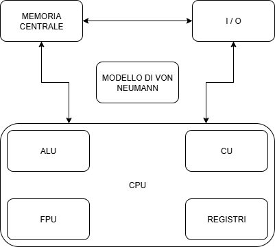
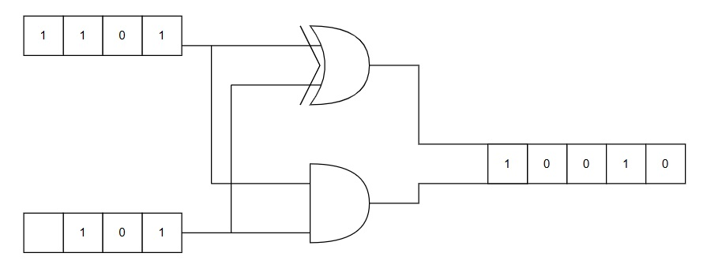
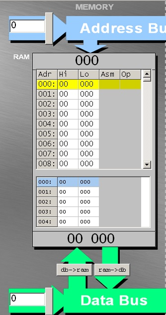
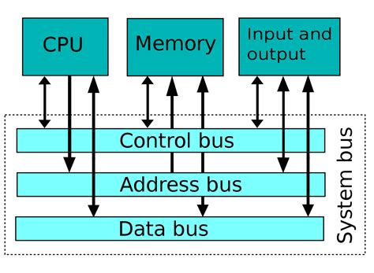
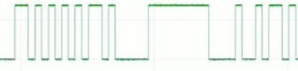

# Indice lezioni
## Ordino le lezioni con materiale utile per le verifiche

### Mi raccomando non sono utili solo questi appunti ma anche gli approfondimenti che vi ho assegnato.

Modello di Von Neumann

<table>
  <tr>
    <td>
      

        Nell'architettura di Von Neumann abbiamo 2 componenti fondamentali: 
        <ul>
            <li> <b>Elaborazione</b> -> CPU: "central processing unit" ovvero "unità centrale di elaborazione</li>
            <li> <b>Memorizzazione</b> -> MEMORIA CENTRALE: a livello teorico la possiamo indicare così ma nella realtà ci riferiamo alla RAM ("random access memory" ovvero "memoria ad accesso casuale")</li>
            <li> <b>Trasmissione</b> -> Bus: canale di comunicazione che permette a periferiche e componenti di un sistema elettronico di interfacciarsi tra loro scambiandosi informazioni. Il percorso principale è uno ma suddiviso in tre categorie di bus: indirizzi, dati e di controllo.</li>
            <li> <b>Comunicazione</b> -> Unità di I/O: permettono l'immissione di informazioni per l'elaborazione e la restituzione dei medesimi o altri elaborati all'operatore</li>
      	</ul>
      

    </td>
    <td>
      
    </td>
  </tr>
  
</table>

Elaborazione

<table>
  <tr>
    <td>
      

        <b>CPU</b>
        <ul>
	<li><b>ALU</b>: Arithmetic and Logic Unit ovvero unità aritmetico logica, il cui scopo è effettuare i calcoli matematici e logici (matematica boleana)</li>
	<li><b>CU</b>: Control Unit ovvero unità di controllo, il cui scopo è coordinare tutte le azioni necessarie per l'esecuzione di una istruzione o di un insieme di istruzioni (come abbiamo detto in classe coordina gli altri componenti nella corretta esecuzione delle istruzioni)</li>
	<li><b>FPU</b>: Floating Point Unit ovvero unità di calcolo in virgola mobile, il cui compito sono i calcoli matematici in virgola mobile</li>
	<li><b>RU</b>: Register Unit ovvero unità di registro, il cui compito è memorizzare lo stato in cui si trova la CPU</li>
	</ul>
      

    </td>
    <td>
      
    </td>
  </tr>
  <tr>
    <td>
        <ul>
            <li> <b>Elaborazione:</b> per simulare un circuito che effettui la somma, in aula abbiamo proceduto a ritroso partendo dalla somma tra due numeri espressi in binario, per poi realizzare un circuito "combinatorio"</li>
            Ho scritto <b>combinatorio</b> tra virgolette come ora in grassetto appositamente perchè da quello che abbiamo visto in classe la ALU non è un circuito combinatorio, ma per questo esempio alla fine ne realizziamo uno.
        </ul>
    </td>
    <td>
        <ul>
            1101+101=10010
            <table>
              <tr>
                <td>1</td>
                <td>1</td>
                <td>0</td>
              </tr>
              <tr>
                <td>0</td>
                <td>0</td>
                <td>1</td>
              </tr>
              <tr>
                <td>1</td>
                <td>1</td>
                <td>0</td>
              </tr>
              <tr>
                <td>1</td>
                <td>0</td>
                <td>0</td>
              </tr>
              <tr>
                <td>0</td>
                <td>0</td>
                <td>1</td>
              </tr>
            </table>
        </ul>
    </td>
  </tr>
  <tr>
    <td>
      <li> Con questo metodo ci rendiamo conto che dovendo gestire due fasi (somma e riporto), necessitiamo di due porte logiche. Nella prima colonna 1101, nella seconda 101 e nella terza il risultato dell'operazione</li>
    </td>
    <td>
      Somma senza riporto (XOR)
      <table>
        <tr>
         <td>1</td>
         <td>1</td>
         <td>0</td>
        </tr>
        <tr>
          <td>0</td>
          <td>0</td>
          <td>0</td>
        </tr>
        <tr>
          <td>1</td>
          <td>1</td>
          <td>0</td>
        </tr>
        <tr>
          <td>1</td>
          <td>0</td>
          <td>1</td>
        </tr>
        <tr>
          <td>0</td>
          <td>0</td>
          <td>0</td>
        </tr>
      </table>
            Solo riporto (AND)
      <table>
        <tr>
         <td>1</td>
         <td>1</td>
         <td>1</td>
        </tr>
        <tr>
          <td>0</td>
          <td>0</td>
          <td>0</td>
        </tr>
        <tr>
          <td>1</td>
          <td>1</td>
          <td>1</td>
        </tr>
        <tr>
          <td>1</td>
          <td>0</td>
          <td>0</td>
        </tr>
        <tr>
          <td>0</td>
          <td>0</td>
          <td>0</td>
        </tr>
      </table>
    </td>
  </tr>
  <tr>
    <td>
      <li> Alla fine ci siamo resi conto che essendo le tabelle di verità delle porte logiche AND e XOR, probabilmente il circuito finale sarebbe somigliato molto all'immagine a lato</li>
    </td>
    <td>
      
    </td>
  </tr>
</table>

Memorizzazione

<table>
  <tr>
    <td>
      

	<UL>
	<b>RAM</b>
		<li>Memoria ad <b>accesso casuale</b>, definità così perchè il tempo di accesso a ciascuna locazione di memoria, non dipende dalla locazione stessa (in breve il tempo di accesso alle informazioni è sempre il medesimo sia che si trovi nelle prime locazioni che nelle ultime). 
		Da definizione sappiamo anche essere definita come memoria <b>volatile</b> e questo dipende dal fatto che la capacità di memorizzare informazioni sia fattibile solo se alimentata  
		<li>Gli indirizzi sono espressi in <b>esadecimale</b> (sul jhonny giocosamente in decimale)</li>
		<li>Può contenere due tipi di informazioni: <b>istruzioni</b> o <b>valori</b></li>	
	</ul>
      

    </td>
    <td>
      
    </td>
  </tr>
  <tr>
    <td>
      <ul>
        <li> Nel caso della <b>memorizzazione</b> abbiamo parlato del latch sr. Di cosa si tratta, niente popò di meno che dell'unità elementare di memoria (se l'immagine è troppo piccola cliccandoci sopra vi apre la directory ove presente il file originale)</li>
      </ul>
    </td>
    <td>
      
    </td>
  </tr>
</table>
	

Comunicazione

<table>
  <tr>
    <td>
      

        <ul>
        <b>Unità di input</b>  
        Tramite la quale i dati vengono inseriti nel calcolatore per essere elaborati
        </ul>
        <ul>
        <b>Unità di output</b>  
        Necessaria affinché i dati elaborati possano essere restituiti all'operatore
        </ul>
      

    </td>
  </tr>
</table>

Trasmissione

<table>
  <tr>
    <td>
      

        <ul>
          <b>BUS</b>  
          <li>è un canale di comunicazione che permette a periferiche e componenti di un sistema elettronico - come ad esempio un computer - di interfacciarsi tra loro scambiandosi informazioni o dati di vario tipo attraverso la trasmissione e la ricezione di segnali.</li>
        </ul>
        <ul>
        </ul>
      

    </td>
    <td>
      
    </td>
  </tr>
  <tr>
    <td>
      <ul>
        Abbiamo visto due tipi di bus:
        <li> <b>Seriale</b> </li>
        <li> <b>Parallelo</b> </li>
      </ul>
    </td>
  </tr>
</table>

Seriale

<table>
  <tr>
    <td>Nella seriale, abbiamo due tipi di comunicazione: sincrona e asincrona</td>
    <td>
       <ul>
        <li>
        <b>Sincrona</b> perchè le due parti della comunicazione sono sincronizzati mediante il <b>clock</b> e non si necessità di prendere i tempi di trasmissione per poter comunicare.
        </li>
        <li>
        <b>Asincrona</b> perchè bisogna analizzare il comportamento sulla seriale per comprendere i tempi di trasmissione ed effettuare così la lettura più corretta, ovviamente in lettura si attende il <b>bit di start</b>, e per terminare il <b>bit di stop</b>. Opzionalmente si può trovare anche il <b>bit di parità</b>. In merito ad analizzare il comportamento per comprendere i tempi di trasmissione, bisogna tenere presente che ciascun bit trasmesso è attivo per tot tempo (<b>micro o nano</b> secondi, su arduino per esempio si parla di microsecondi). L'anno prossimo in teoria, osserverete meglio questo dettaglio tecnico.
        </li>
      <ul>     
    </td>
  </tr>
  <tr>
    <td>
        In classe abbiamo analizzato il possibile comportamento del bus in tutte le suo sfaccettature. (risultati simili al <b>pycoscope</b>)
        Ebbene si parla di un onda quadra, perciò il risultato sembra essere la merlatura disordinata di un castello con la parte alta a <b>5v</b> e la parte bassa più o meno a <b>0v</b>. Quando abbiamo un segnale <b>alto</b> stiamo trasmettendo il valore <b>1</b>, quando abbiamo un segnale <b>basso</b> stiamo trasmettendo il valore <b>0</b>.
    </td>
    <td>
      
    </td>
  </tr>
</table>

22

33

44

55

66

## Link utili
 - [Fonti alu](https://www.instructables.com/8-bit-ALU-Arithmetic-Logic-Unit)
 - [Fonti alu](https://www.101computing.net/8-bit-alu-using-logic-gates/)
-----

[def]: mg/bus.jp