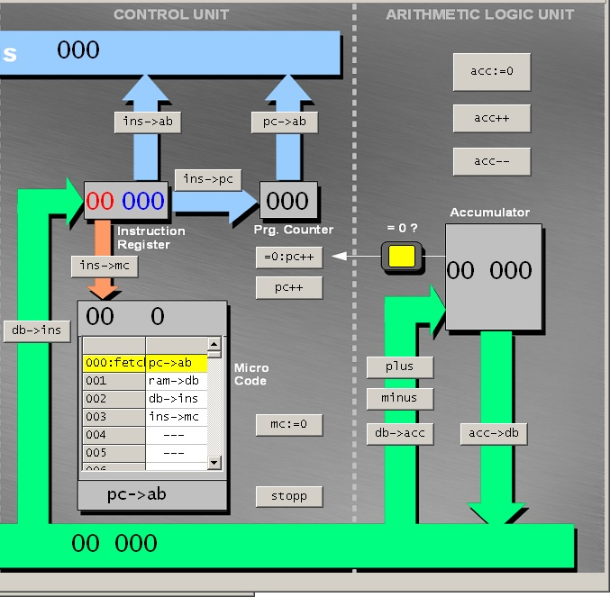
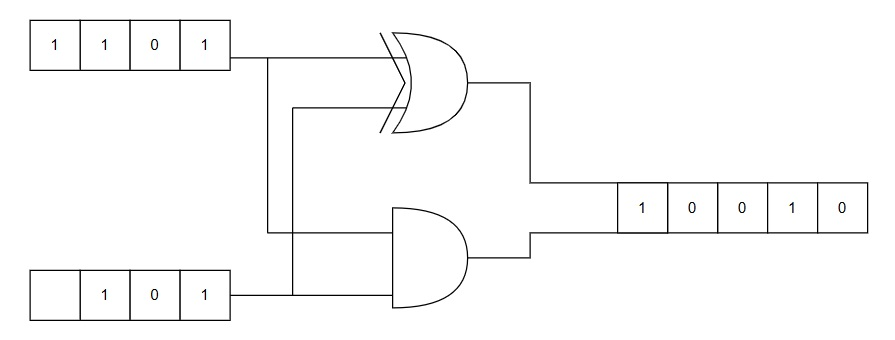

# ELABORAZIONE
<table>
  <tr>
    <td>
      

        <b>CPU</b>
        <ul>
    <li><b>ALU</b>: Arithmetic and Logic Unit ovvero unità aritmetico logica, il cui scopo è effettuare i calcoli matematici e logici (matematica boleana)</li>
    <li><b>CU</b>: Control Unit ovvero unità di controllo, il cui scopo è coordinare tutte le azioni necessarie per l'esecuzione di una istruzione o di un insieme di istruzioni (come abbiamo detto in classe coordina gli altri componenti nella corretta esecuzione delle istruzioni)</li>
    <li><b>FPU</b>: Floating Point Unit ovvero unità di calcolo in virgola mobile, il cui compito sono i calcoli matematici in virgola mobile</li>
    <li><b>RU</b>: Register Unit ovvero unità di registro, il cui compito è memorizzare lo stato in cui si trova la CPU</li>
    </ul>
      

    </td>
    <td>
      
    </td>
  </tr>
  <tr>
    <td>
        <ul>
            <li> <b>Elaborazione:</b> per simulare un circuito che effettui la somma, in aula abbiamo proceduto a ritroso partendo dalla somma tra due numeri espressi in binario, per poi realizzare un circuito combinatorio.</li>
        </ul>
    </td>
    <td>
        <ul>
            1101+101=10010
            <table>
              <tr>
                <td>1</td>
                <td>1</td>
                <td>0</td>
              </tr>
              <tr>
                <td>0</td>
                <td>0</td>
                <td>1</td>
              </tr>
              <tr>
                <td>1</td>
                <td>1</td>
                <td>0</td>
              </tr>
              <tr>
                <td>1</td>
                <td>0</td>
                <td>0</td>
              </tr>
              <tr>
                <td>0</td>
                <td>0</td>
                <td>1</td>
              </tr>
            </table>
        </ul>
    </td>
  </tr>
  <tr>
    <td>
      <ul>
        <li> Con questo metodo ci rendiamo conto che dovendo gestire due fasi (somma e riporto), necessitiamo di due porte logiche. Nella prima colonna 1101, nella seconda 101 e nella terza il risultato dell'operazione</li>
      </ul>
    </td>
    <td>
      Somma senza riporto (XOR)
      <table>
        <tr>
         <td>1</td>
         <td>1</td>
         <td>0</td>
        </tr>
        <tr>
          <td>0</td>
          <td>0</td>
          <td>0</td>
        </tr>
        <tr>
          <td>1</td>
          <td>1</td>
          <td>0</td>
        </tr>
        <tr>
          <td>1</td>
          <td>0</td>
          <td>1</td>
        </tr>
        <tr>
          <td>0</td>
          <td>0</td>
          <td>0</td>
        </tr>
      </table>
            Solo riporto (AND)
      <table>
        <tr>
         <td>1</td>
         <td>1</td>
         <td>1</td>
        </tr>
        <tr>
          <td>0</td>
          <td>0</td>
          <td>0</td>
        </tr>
        <tr>
          <td>1</td>
          <td>1</td>
          <td>1</td>
        </tr>
        <tr>
          <td>1</td>
          <td>0</td>
          <td>0</td>
        </tr>
        <tr>
          <td>0</td>
          <td>0</td>
          <td>0</td>
        </tr>
      </table>
    </td>
  </tr>
  <tr>
    <td>
      <ul>
        <li> Alla fine ci siamo resi conto che essendo le tabelle di verità delle porte logiche AND e XOR, probabilmente il circuito finale sarebbe stato simile all'immagine a lato</li>
      </ul>
    </td>
    <td>
      
    </td>
  </tr>
</table>