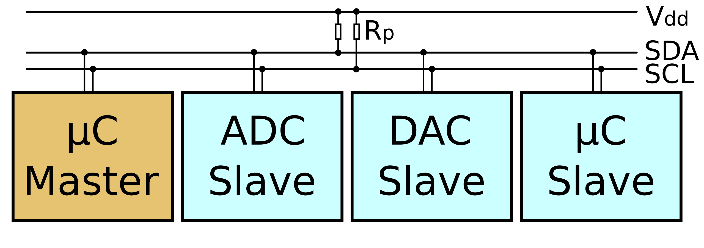

# I2C - IIC - INTER INTEGRATED CIRCUIT

<table>
  <tr>
    <td>
      Comunicazione standar in arduino ma non solo, sfrutta una connessione <b>sincrona</b> quindi dotata di <b>SCL</b> (serial clock).
      Essendo una seriale la transizione dei dati avviene su di un unico tracciato <b>SDA</b> (serial data), ma importante non dimenticare l'<b>alimentazione</b> (V) e la <b>massa</b> (GND). 
      La comunicazione è gestita dal <b>master</b> verso un determinato <b>slave</b> identificato da un indirizzo. Il master in uno schema appare per essere uno solo ma in realtà non è indispensabile che ce ne sia uno solo, difatti diversi dispositivi in grado di far partire una comunicazione possono assumere il ruolo di master. Pensate a diversi arduino presenti in un progetto. 
    </td>
    <td>
       
    </td>
  </tr>
</table>