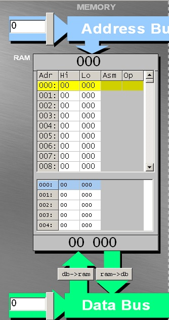
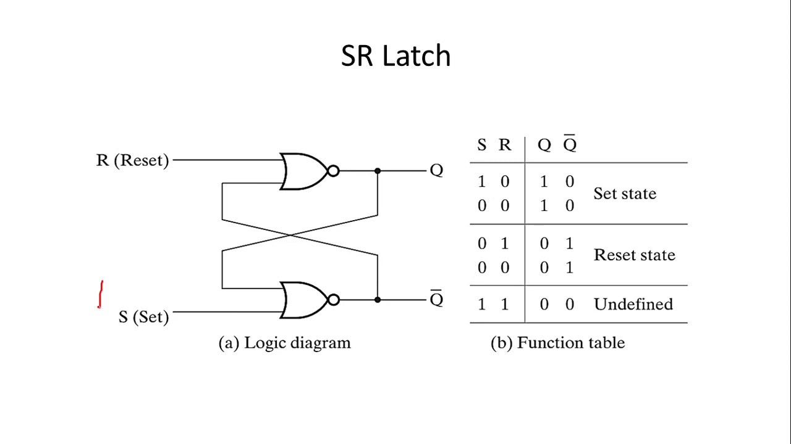

# MEMORIZZAZIONE

<table>
  <tr>
    <td>
      

    <UL>
    <b>RAM</b>
        <li>Memoria ad <b>accesso casuale</b>, definità così perchè il tempo di accesso a ciascuna locazione di memoria, non dipende dalla locazione stessa (in breve il tempo di accesso alle informazioni è sempre il medesimo sia che si trovi nelle prime locazioni che nelle ultime). 
        Da definizione sappiamo anche essere definita come memoria <b>volatile</b> e questo dipende dal fatto che la capacità di memorizzare informazioni sia fattibile solo se alimentata (inoltre non è costante in quanto non ha un contenuto costante)</li>
        <li>Gli indirizzi sono espressi in <b>esadecimale</b> (sul jhonny giocosamente in decimale)</li>
        <li>Può contenere due tipi di informazioni: <b>istruzioni</b> o <b>valori</b></li>	
    </ul>
      

    </td>
    <td>
      
    </td>
  </tr>
  <tr>
    <td>
      <ul>
        <li> Nel caso della <b>memorizzazione</b> abbiamo parlato del latch sr. Di cosa si tratta, niente popò di meno che dell'unità elementare di memoria (se l'immagine è troppo piccola cliccandoci sopra vi apre la directory ove presente il file originale)</li>
        <li>
          Nell'immagine notiamo le 2 "uscite", tra virgolette perchè in realtà è solo una l'uscita importante (<b>Q</b>), ed è quella da cui vengono letti i valori. L'altra uscita (<b>Q negato</b>), indica lo stato memorizzato utile anche per le fasi successive.
          In realtà serve sia il valore positivo che quello negato per pilotare circuiti digitali senza aggiungere un inverter esterno... ma questo se non lo avete capito no problem -> non ve lo chiedo in verifica tranquilli.
        </li>
      </ul>
    </td>
    <td>
      
    </td>
  </tr>
</table>
