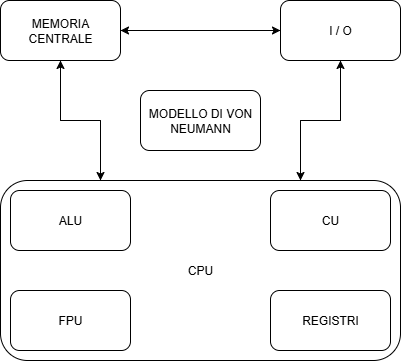

# MODELLO DI VON NEUMANN
<table>
  <tr>
    <td>
      

        Nell'architettura di Von Neumann abbiamo possiamo distinguere i componenti in base ai ruoli: 
        <ul>
            <li> <b>Elaborazione</b> -> CPU: "central processing unit" ovvero "unità centrale di elaborazione"</li>
            <li> <b>Memorizzazione</b> -> MEMORIA CENTRALE: a livello teorico la possiamo indicare  così ma dal punto di vista pratico è utile pensare alla RAM ("random access memory" ovvero "memoria ad accesso casuale")</li>
            <li> <b>Trasmissione</b> -> Bus: canale di comunicazione che permette a periferiche e componenti  di un sistema elettronico di interfacciarsi tra loro scambiandosi informazioni.  Il percorso principale è uno ma suddiviso in tre categorie di bus: indirizzi, dati e di controllo.</li>
            <li> <b>Comunicazione</b> -> Unità di I/O: permettono l'immissione di informazioni per l'elaborazione  e la restituzione dei medesimi o altri elaborati all'operatore</li>
        </ul>
      

    </td>
    <td>
      
    </td>
  </tr>
</table>