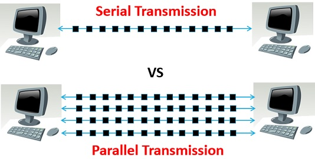

# PARALLELA

<table>
  <tr>
    <td>
      In classe ne abbiamo parlato in breve e anche qui ne parlo brevemente. Per brevi distanze e basse frequenze, la comunicazione parallela è <b>veloce</b> perché più bit trasmettono <b>contemporaneamente</b>, ma allungando le distanze ci sono numerosi fattori che influiscono negativamente sulla gestione del segnale. Il problema maggiore è rappresentato dal <b>crosstalk</b> o meglio la possibilità che i bit saltino in altri canali o bus (<b>interferenze o gestione differente della trasmissione nel ricevente</b>), oltre a questo entra in gioco l'elemento fisico ovvero la <b>struttura cristallina</b> del metallo: anche se ciascun tracciato della parallela è prodotto in ugual modo agli altri si possono generare delle imperfezioni nella struttura cristallina che su lunghe distanze e con milioni di transazioni al secondo, provocano problemi difficili da risolvere (questo perchè varia la resistenza del metallo).
      Inutile sottolineare il fatto che in fase di trasmissione in una parallela transitano contemporaneamente tanti bit e che in caso di interferenza dall'esterno si rischia di perderli tutti in blocco. 
    </td>
    <td>
      
    </td>
  </tr>
</table>