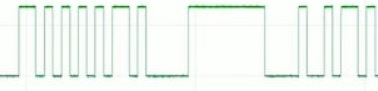

# SERIALE

<table>
  <tr>
    <td>Nella seriale, abbiamo due tipi di comunicazione: sincrona e asincrona</td>
    <td>
       <ul>
        <li>
        <b>Sincrona</b> perchè le due parti della comunicazione sono sincronizzati mediante il <b>clock</b> e non si necessità di prendere i tempi di trasmissione per poter comunicare.
        </li>
        <li>
        <b>Asincrona</b> perchè bisogna analizzare il comportamento sulla seriale per comprendere i tempi di trasmissione ed effettuare così la lettura più corretta, ovviamente in lettura si attende il <b>bit di start</b>, e per terminare il <b>bit di stop</b>. Opzionalmente si può trovare anche il <b>bit di parità</b>. In merito ad analizzare il comportamento per comprendere i tempi di trasmissione, bisogna tenere presente che ciascun bit trasmesso è attivo per tot tempo (<b>micro o nano</b> secondi, su arduino per esempio si parla di microsecondi). L'anno prossimo in teoria, osserverete meglio questo dettaglio tecnico.
        </li>
      <ul>     
    </td>
  </tr>
  <tr>
    <td>
        In classe abbiamo analizzato il possibile comportamento del bus in tutte le suo sfaccettature. (risultati simili al <b>pycoscope</b>)
        Ebbene si parla di un onda quadra, perciò il risultato sembra essere la merlatura disordinata di un castello con la parte alta a <b>5v</b> e la parte bassa più o meno a <b>0v</b>. Quando abbiamo un segnale <b>alto</b> stiamo trasmettendo il valore <b>1</b>, quando abbiamo un segnale <b>basso</b> stiamo trasmettendo il valore <b>0</b>.
    </td>
    <td>
      
    </td>
  </tr>
</table>
