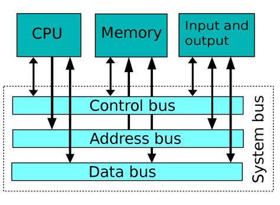

# TRASMISSIONE

<table>
  <tr>
    <td>
      <ul>
         <b>BUS</b>  
         <li>è un canale di comunicazione che permette a periferiche e componenti di un sistema elettronico - come ad esempio un computer - di interfacciarsi tra loro scambiandosi informazioni o dati di vario tipo attraverso la trasmissione e la ricezione di segnali.</li>
         Abbiamo visto tre tipi di bus:
         <li> <b>Data bus</b> </li> Bus ove transitano sia dati che istruzioni, utilizzato da tutti i dispositivi del sistema.
         <li> <b>Address bus</b> </li> Bus dove transitano indirizzi ove la cpu scrive o legge informazioni.
         <li> <b>Control bus</b> </li> Bus adibito al controllo e coordinamento delle attività del sistema, tramite esso la cpu può decidere quale componente deve scrivere sul data bus in un determinato momento, quale indirizzo leggere ...
      </ul>
    </td>
    <td>
      
    </td>
  </tr>
  <tr>
    <td>
      <ul>
        Abbiamo visto due tipi di comunicazione:
        <li>Seriale</li>
        <li>Parallelo</li>
      </ul>
    </td>
  </tr>
</table>
